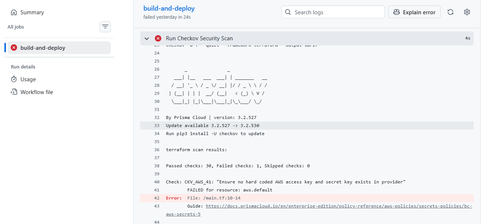

# Automated DevSecOps Pipeline 🛡️🚀

## Project Overview
Manual infrastructure deployment is slow, prone to human error, and often introduces security vulnerabilities that go unnoticed until the infrastructure is already live in the cloud. 

This project solves that by implementing a fully automated, zero-touch CI/CD pipeline. 

## The Architecture

## The Solution
I architected and deployed a pipeline where any new infrastructure code pushed to the repository automatically triggers a strict security scan using GitHub Actions. 
1. **Code Commit:** Developer pushes Terraform code to GitHub.
2. **Security Gate:** GitHub Actions triggers `tfsec` to scan for misconfigurations.
3. **Deployment:** If the code passes all security gates, Terraform automatically provisions the resources directly into the AWS environment.

## The Business Impact
* **Automated Security:** Prevented misconfigurations and vulnerabilities from reaching production by implementing automated "shift-left" security scanning.
* **Velocity & Consistency:** Eliminated manual provisioning, ensuring infrastructure is deployed exactly the same way every single time in a matter of seconds.

## Core Technologies
* **Cloud Provider:** AWS
* **Infrastructure as Code:** Terraform
* **CI/CD:** GitHub Actions
* **Security Scanning:** tfsec

## Simulated Case Study: Secret Scanning Incident

**Situation:** During a routine sprint, a developer accidentally committed a plaintext AWS Access Key and Secret Key directly into the application's source code before pushing to the repository.

**Task:** My objective was to ensure the CI/CD pipeline automatically intercepted the compromised credentials before they could be built into the container or deployed to the live environment, while immediately alerting the team to rotate the keys.

**Action:** I engineered the CI/CD pipeline to run an automated secret-scanning security gate immediately upon any new pull request. When the developer attempted to commit the credentials, the pipeline scanned the code diff, identified the AWS key signatures using regex pattern matching, and instantly failed the build. Simultaneously, the pipeline routed an automated alert to the development team detailing the exact file and line number of the exposure.

**Result:** The compromised code was completely blocked from reaching the deployment phase, preventing a potentially catastrophic cloud security breach. The team immediately rotated the exposed AWS keys, revoked the old credentials, and merged a sanitized version of the code, resulting in zero compromised infrastructure and zero deployment downtime.

## DevSecOps Integration: Proactive Threat Detection 

This screenshot demonstrates the CI/CD pipeline intentionally halting a deployment. The integrated Checkov security scanner successfully detected simulated AWS credentials committed to the repository, blocking the Terraform execution to prevent exposed secrets from reaching the cloud environment. 

