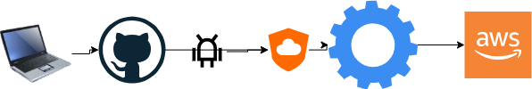

# Automated DevSecOps Pipeline 🛡️🚀

## Project Overview
Manual infrastructure deployment is slow, prone to human error, and often introduces security vulnerabilities that go unnoticed until the infrastructure is already live in the cloud. 

This project solves that by implementing a fully automated, zero-touch CI/CD pipeline. 

## The Architecture

## The Solution
I architected and deployed a pipeline where any new infrastructure code pushed to the repository automatically triggers a strict security scan using GitHub Actions. 
1. **Code Commit:** Developer pushes Terraform code to GitHub.
2. **Security Gate:** GitHub Actions triggers `tfsec` to scan for misconfigurations.
3. **Deployment:** If the code passes all security gates, Terraform automatically provisions the resources directly into the AWS environment.

## The Business Impact
* **Automated Security:** Prevented misconfigurations and vulnerabilities from reaching production by implementing automated "shift-left" security scanning.
* **Velocity & Consistency:** Eliminated manual provisioning, ensuring infrastructure is deployed exactly the same way every single time in a matter of seconds.

## Core Technologies
* **Cloud Provider:** AWS
* **Infrastructure as Code:** Terraform
* **CI/CD:** GitHub Actions
* **Security Scanning:** tfsec
